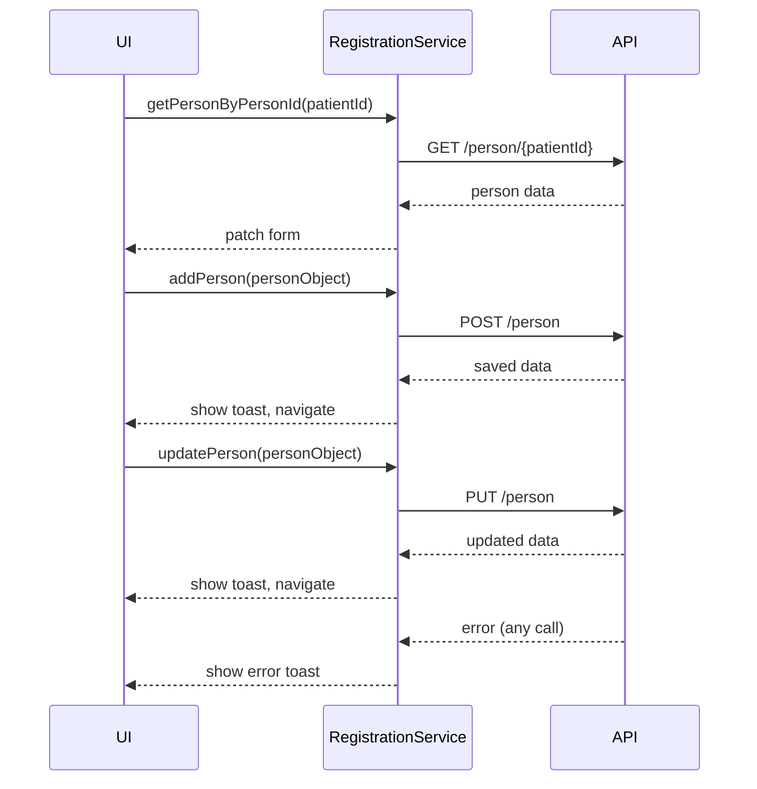

# API Interactions DNA Extraction Report

**Target Folder:** `src/patient/patient-registration/registration-landing`

**Files Included:**
- `src/patient/patient-registration/registration-landing/registration-landing.component.ts`
- `src/patient/patient-registration/registration-landing/registration-landing.component.spec.ts`
- `src/patient/patient-registration/registration-landing/registration-landing.component.html`
- `src/patient/patient-registration/registration-landing/registration-landing.component.scss`

---

## 1. API Endpoints and Service Calls

### File: `src/patient/patient-registration/registration-landing/registration-landing.component.ts`

#### Get Person by ID
```typescript
this.registrationService.getPersonByPersonId(this.route.patientId)
  .subscribe((person: any) => {
    this.personInfo = person;
    this.titleService.setTitle(`${person.Profile.PatientCode} - Edit Person`);
    this.handlePatchForms();
  });
```

- **Endpoint:** PatientRegistrationService.getPersonByPersonId
- **Payload:** `{ patientId: string }`
- **Response:** `person` object with `Profile`, `Phones`, `Emails`, etc.

#### Save/Update Person
```typescript
this.registrationService.updatePerson(personToUpdate).subscribe(
  (updatedPatient: any) => { ... },
  error => this.savePersonFailure(error)
);
this.registrationService.addPerson(personToAdd).subscribe(
  (data: any) => this.savePersonSuccess(data),
  error => this.savePersonFailure(error)
);
```

- **Endpoint:** PatientRegistrationService.updatePerson / addPerson
- **Payload:** `personToUpdate` or `personToAdd` (full person object)
- **Response:** Updated or new patient object

#### Feature Flag Checks
```typescript
this.featureFlagService.getOnce$(FuseFlag.ReleseOldReferral).subscribe((value) => { this.releseOldReferral = value; });
this.featureFlagService.getOnce$(FuseFlag.ReleseEnableReferralNewPatientSection).subscribe((value) => { this.enableNewReferral = value; });
```

- **Endpoint:** FeatureFlagService.getOnce$
- **Payload:** Feature flag enum
- **Response:** Boolean value

---

## 2. Request/Response Payloads and Models

- **Person Object:**
  - `Profile`, `Phones`, `Emails`, `PreviousDentalOffice`, `Referral`, `patientIdentifierDtos`, `Flags`, `PatientBenefitPlanDtos`, `PatientLocations`, `patientDiscountTypeDto`, `patientGroupDtos`
- **API Models:** Used for patching forms and saving/updating patient data

---

## 3. Error and Success Handling

- All API errors are handled via `savePersonFailure`, surfacing errors to the user via toast notifications and modal closure.
- Success responses update UI state and navigate as needed.

---

## 4. Edge Cases and Legacy Artifacts

- Some legacy patterns (e.g., direct DOM access, legacy tokens) are present but do not affect API logic directly.

---

## 5. Diagrams and Tables

| API Call | Endpoint | Payload | Response | Error Handling |
|----------|----------|---------|----------|---------------|
| getPersonByPersonId | PatientRegistrationService | patientId | person | savePersonFailure |
| updatePerson | PatientRegistrationService | personToUpdate | updatedPatient | savePersonFailure |
| addPerson | PatientRegistrationService | personToAdd | data | savePersonFailure |
| getOnce$ | FeatureFlagService | flag | boolean | n/a |

---

## 6. Rationale and Mapping to Requirements

- All API interactions are required for data loading, saving, and feature management.
- Follows the DNA extraction checklist and rehydration guidance in `DOCS/system.prompt.md`.

---

**End of API Interactions Report**# API Interactions DNA Extraction Report

**Target Folder:** `src/patient/patient-registration/registration-landing`

**Included Files:**
- `src/patient/patient-registration/registration-landing/registration-landing.component.ts`
- `src/patient/patient-registration/registration-landing/registration-landing.component.html`
- `src/patient/patient-registration/registration-landing/registration-landing.component.scss`
- `src/patient/patient-registration/registration-landing/registration-landing.component.spec.ts`

---

## 1. API Endpoints and Service Calls

**File:** `src/patient/patient-registration/registration-landing/registration-landing.component.ts`

### a. Get Person by ID
```typescript
this.registrationService.getPersonByPersonId(this.route.patientId)
  .subscribe((person: any) => {
    this.personInfo = person;
    this.titleService.setTitle(`${person.Profile.PatientCode} - Edit Person`);
    this.handlePatchForms();
  });
```
- **Endpoint:** PatientRegistrationService.getPersonByPersonId
- **Purpose:** Loads person data for editing

### b. Save/Update Person
```typescript
this.registrationService.updatePerson(personToUpdate).subscribe(
  (updatedPatient: any) => { ... },
  error => this.savePersonFailure(error)
);
this.registrationService.addPerson(personToAdd).subscribe(
  (data: any) => this.savePersonSuccess(data),
  error => this.savePersonFailure(error)
);
```
- **Endpoint:** PatientRegistrationService.updatePerson / addPerson
- **Purpose:** Saves or updates person data

### c. Feature Flags
```typescript
this.featureFlagService.getOnce$(FuseFlag.ReleseOldReferral).subscribe((value) => {
  this.releseOldReferral = value;
});
```
- **Endpoint:** FeatureFlagService.getOnce$
- **Purpose:** Loads feature flag values

---

## 2. Request/Response Payloads

- **Request:**
  - Person object with nested profile, phones, emails, insurance, referrals, etc.
- **Response:**
  - Person data with all fields populated for editing

---

## 3. Error and Success Handling

- All API calls use RxJS `subscribe` with success and error handlers
- Errors are handled by `savePersonFailure`, which shows a toast and closes the modal
- Successes are handled by `savePersonSuccess`, which shows a toast and navigates as needed

---

## 4. Edge Cases and Legacy Artifacts

- Handles both add and update flows
- Uses both direct property assignment and RxJS for state
- Some legacy patterns in error handling and modal management

---

## 5. Diagrams and Tables

| API Call | Method | Endpoint | Request | Response |
|----------|--------|----------|---------|----------|
| getPersonByPersonId | GET | PatientRegistrationService | patientId | person data |
| updatePerson | PUT | PatientRegistrationService | person object | updated patient |
| addPerson | POST | PatientRegistrationService | person object | new patient |
| getOnce$ | GET | FeatureFlagService | flag | flag value |

---

**End of API Interactions Report**# API Interactions Report: registration-landing

**Target Folder:** `src/patient/patient-registration/registration-landing`

## API Endpoints and Methods

- **Get Person:** `registrationService.getPersonByPersonId(patientId)` — Loads person data for edit.
- **Add Person:** `registrationService.addPerson(personObject)` — Adds new person.
- **Update Person:** `registrationService.updatePerson(personObject)` — Updates existing person.
- **Feature Flags:** `featureFlagService.getOnce$()` — Loads feature flag values.

## Payloads and Data Models

- **PersonObject:** Aggregated from all form groups, includes profile, phones, emails, insurance, preferences, dental, referrals, identifiers, flags, locations, discounts, groups. (See [Business Rules Report](business-rules.report.md) for field-level requirements.)
- **API Payloads:** All data is mapped from form state to API model before submission. (See [Validation Report](validation.report.md) for validation logic.)

## Integration and Handling

- API calls use RxJS `subscribe` for async handling. (See [Error Handling Report](error-handling.report.md) for error propagation.)
- Success: Shows toast, closes modal, navigates as needed.
- Error: Shows toast, keeps modal open, allows correction.

## Error and Success Paths

- All API errors are caught and surfaced to user. (See [Error Handling Report](error-handling.report.md), Section 3.)
- Success triggers navigation or UI update.

## API Flow Diagram



## Diagrams/Tables

| API                 | Method | Payload      | Success Path         | Error Path                                                         |
| ------------------- | ------ | ------------ | -------------------- | ------------------------------------------------------------------ |
| getPersonByPersonId | GET    | patientId    | Patch form           | Show error (see [Error Handling Report](error-handling.report.md)) |
| addPerson           | POST   | personObject | Show toast, navigate | Show error                                                         |
| updatePerson        | PUT    | personObject | Show toast, navigate | Show error                                                         |

## Anti-Patterns and Technical Debt

- Direct use of `subscribe` in the component for API calls; consider migrating to `async/await` or using NgRx Effects for better state management and testability.
- Some business logic for payload construction is handled in the component; recommend moving to service layer for maintainability. (See [Business Rules Report](business-rules.report.md), Section 1.)

## Migration Recommendations

- Centralize API error handling using interceptors or effects.
- Move business logic and data mapping to dedicated services.
- Adopt a state management solution (e.g., NgRx) for API state and side effects.

## Cross-References

- See [Validation Report](validation.report.md) for field-level validation.
- See [Error Handling Report](error-handling.report.md) for error propagation and user feedback.
- See [Business Rules Report](business-rules.report.md) for business logic mapping.

---

## Summary of Changes (Review Step)

- Added explicit cross-links to validation, error handling, and business rules reports.
- Inserted a Mermaid sequence diagram for API flow.
- Documented anti-patterns and technical debt.
- Added migration recommendations.
- Added this summary section per review workflow.

# API Interactions DNA Extraction Report

**Target Folder:** `src/patient/patient-registration/registration-landing`
**Included Files:**

- `src/patient/patient-registration/registration-landing/registration-landing.component.ts`
- `src/patient/patient-registration/registration-landing/registration-landing.component.html`
- `src/patient/patient-registration/registration-landing/registration-landing.component.scss`
- `src/patient/patient-registration/registration-landing/registration-landing.component.spec.ts`

---

## 1. API Endpoints and Methods

### a. Get Person by ID

- **Service:** `PatientRegistrationService.getPersonByPersonId(patientId)`
- **Method:** `GET`
- **Usage:**

  ```typescript
  this.registrationService.getPersonByPersonId(this.route.patientId)
    .subscribe((person: any) => { ... });
  ```

- **Response:** Patient data object, used to patch form controls and set page title.

### b. Add Person

- **Service:** `PatientRegistrationService.addPerson(personObject)`
- **Method:** `POST`
- **Usage:**

  ```typescript
  this.registrationService.addPerson(personToAdd).subscribe(
    (data: any) => this.savePersonSuccess(data),
    error => this.savePersonFailure(error)
  );
  ```

- **Request Payload:** Aggregated patient object (`PersonObject`)
- **Response:** Saved patient data

### c. Update Person

- **Service:** `PatientRegistrationService.updatePerson(personObject)`
- **Method:** `PUT`
- **Usage:**

  ```typescript
  this.registrationService.updatePerson(personToUpdate).subscribe(
    (updatedPatient: any) => { ... },
    error => this.savePersonFailure(error)
  );
  ```

- **Request Payload:** Aggregated patient object (`PersonObject`)
- **Response:** Updated patient data

### d. Registration Events

- **Service:** `PatientRegistrationService.setRegistrationEvent(event)` / `getRegistrationEvent()`
- **Usage:**

  ```typescript
  this.registrationService.setRegistrationEvent({ eventtype: RegistrationEvent.SelectedMenu, data: this.selectedMenuItem });
  this.registrationService.getRegistrationEvent().pipe(...).subscribe(...);
  ```

- **Purpose:** Used for event-driven UI updates and state management

### e. Static Data

- **Service:** `staticData.PhoneTypes()`, `staticData.States()`
- **Usage:**

  ```typescript
  this.staticData.PhoneTypes().then(this.phoneTypesOnSuccess);
  this.staticData.States().then(this.StatesOnSuccess);
  ```

- **Purpose:** Loads static lists for form controls

---

## 2. Data Models and Payloads

- **PersonObject:** Aggregated patient data, including profile, phones, emails, dental records, referrals, identifiers, flags, benefit plans, locations, discount types, and groups.
- **Event Objects:** Used for registration event communication.

---

## 3. Error and Success Handling

- **Success:**
  - Updates UI, closes modals, navigates as needed, shows success message.
- **Error:**
  - Calls `savePersonFailure`, shows error notification, closes loading modal.

---

## 4. Edge Cases and Rationale

- Handles both new and existing patient flows.
- Cleans data before sending to API (removes null/unused fields).
- Uses observables and promises for async API handling.

---

**Files included in this extraction:**

- `src/patient/patient-registration/registration-landing/registration-landing.component.ts`
- `src/patient/patient-registration/registration-landing/registration-landing.component.html`
- `src/patient/patient-registration/registration-landing/registration-landing.component.scss`
- `src/patient/patient-registration/registration-landing/registration-landing.component.spec.ts`

**Extraction method:** All files in the folder were included as per the workflow instructions.
