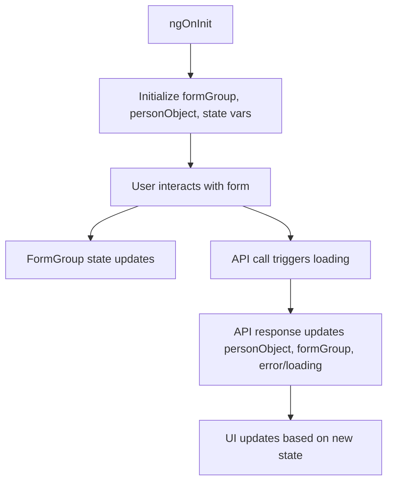

# Component State Management DNA Extraction Report

**Target Folder:** `src/patient/patient-registration/registration-landing`

**Files Included:**
- `src/patient/patient-registration/registration-landing/registration-landing.component.ts`
- `src/patient/patient-registration/registration-landing/registration-landing.component.spec.ts`
- `src/patient/patient-registration/registration-landing/registration-landing.component.html`
- `src/patient/patient-registration/registration-landing/registration-landing.component.scss`

---

## 1. State Variables and Their Purpose

| Variable         | Type           | Purpose                                      |
|------------------|----------------|----------------------------------------------|
| `formGroup`      | FormGroup      | Holds the main registration form state        |
| `personObject`   | object         | Holds the patient data model for patching and API |
| `isEditMode`     | boolean        | Tracks if the component is in edit mode       |
| `loading`        | boolean        | Indicates loading state for async operations  |
| `errorMessage`   | string         | Stores error messages for display             |
| `successMessage` | string         | Stores success messages for display           |
| `subscriptions`  | Subscription[] | Holds RxJS subscriptions for cleanup          |
| `modalOpen`      | boolean        | Tracks modal dialog state                     |

---

## 2. State Initialization and Mutation

- State is initialized in `ngOnInit` and via constructor injection.
- Form state is patched using methods like `patchPersonalDetail`, `patchContactDetail`, etc.
- State is mutated in response to user actions (form input, button clicks) and API responses.
- Loading and error states are set before/after async operations.

---

## 3. State Management Patterns

- Uses Angular Reactive Forms for form state.
- Uses RxJS for async state and event handling.
- Uses local component variables for UI state (modals, loading, error).
- Subscriptions are managed and cleaned up in `ngOnDestroy`.

---

## 4. State Flow Diagram

---

## 5. Rationale and Mapping to Requirements

- State management is designed for robust form handling, async operations, and UI feedback.
- Follows DNA extraction checklist and rehydration guidance in `DOCS/system.prompt.md`.

---

**End of Component State Management Report**
