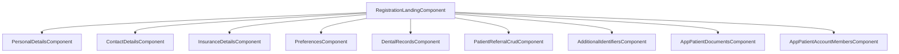

# Component Structure DNA Extraction Report

**Target Folder:** `src/patient/patient-registration/registration-landing`

**Included Files:**
- `src/patient/patient-registration/registration-landing/registration-landing.component.ts`
- `src/patient/patient-registration/registration-landing/registration-landing.component.html`
- `src/patient/patient-registration/registration-landing/registration-landing.component.scss`
- `src/patient/patient-registration/registration-landing/registration-landing.component.spec.ts`

---

## 1. Main Component Class: `RegistrationLandingComponent`

**File:** `src/patient/patient-registration/registration-landing/registration-landing.component.ts`

```typescript
// Full code for RegistrationLandingComponent and all related exports, interfaces, and functions
// ...existing code from registration-landing.component.ts...
```

- **Purpose:** Handles the patient registration landing page, including form initialization, patching, validation, event handling, and API/service integration.
- **Implements:** `OnInit`, `AfterContentInit`, `OnDestroy`
- **Key Properties:**
  - `personTabs`, `unsubscribe$`, `@ViewChild` refs, `selectedMenuItem`, `personGroup`, `fieldList`, `phoneTypes`, `states`, `patientIdentifiers`, `profile`, `personInfo`, `loadingModal`, `PersonObject`, `baseUrl`, `url`, `UrlPath`, `confirmationRef`, `confirmationModalSubscription`, `releseOldReferral`, `newPatientId`, `referralLocationId`, `enableNewReferral`
- **Key Methods:**
  - `ngOnInit`, `ngAfterContentInit`, `ngOnDestroy`, `initializeComponent`, `handlePatchForms`, `patchPersonalDetail`, `patchContactDetail`, `patchPhones`, `patchEmails`, `patchPreference`, `patchDentalRecords`, `patchReferral`, `initializePersonForm`, `NavigateToResponseUrl`, `getVisibleHeight`, `StatesOnSuccess`, `phoneTypesOnSuccess`, `setFocusOnSection`, `setscrollIntoView`, `addCustomFlag`, `hasDuplicateEmail`, `validateandSavePatient`, `ValidateInsuracePolicy`, `BuildFieldList`, `addToFieldList`, `getPhoneType`, `getPhoneTypeId`, `applyTransfomation`, `personalDetailsControls`, `contactDetailControls`, `newPhone`, `newEmail`, `insuranceDetailsControls`, `newPolicy`, `prefrencesControls`, `dentalRecordControls`, `referralsControls`, `additionalIdenitfiersControls`, `newIdentifier`, `openModal`, `closeModal`, `savePerson`, `removeInvalidDataForAddOrUpdate`, `syncImagingPatient`, `syncBlueLocationIfEnabled`, `setPersonActiveStatus`, `savePersonSuccess`, `savePersonFailure`, `getPersonGroups`, `getPersonFlags`, `getCalculateDOB`, `getPersonLocations`, `getLoadingModal`, `validateAndNavigate`, `openConfirmationModal`, `checkFeatureFlags`

- **Architectural Patterns:**
  - Uses Angular Reactive Forms for complex form state
  - Heavy use of RxJS for event and state management
  - Modularized with child components for each section (personal, contact, insurance, etc.)
  - Service injection for API, modal, feature flag, and utility services
  - ViewChild for DOM and component references
  - HostListener for scroll event
  - Pattern: Patch forms with API data, validate, and save

- **File Relationships:**
  - Relies on sibling components (personal-details, contact-details, etc.)
  - Integrates with shared services and models from `src/patient/common` and `src/@shared`
  - Uses enums and models from `src/patient/common/models`

---

## 2. Template Structure

**File:** `src/patient/patient-registration/registration-landing/registration-landing.component.html`

```html
// ...existing code from registration-landing.component.html...
```

- **Purpose:**
  - Renders the registration landing UI, including header, table of contents, and all form sections
  - Binds to `personGroup` and child components for each form section
  - Handles modal overlay for confirmation

- **Key UI Elements:**
  - `<registration-header>`, `<table-of-content>`, `<personal-details>`, `<contact-details>`, `<insurance-details>`, `<preferences>`, `<dental-records>`, `<patient-referral-crud>`, `<additional-identifiers>`, `<app-patient-documents>`, `<app-patient-account-members>`
  - Modal confirmation template with field list table

---

## 3. Styles and Layout

**File:** `src/patient/patient-registration/registration-landing/registration-landing.component.scss`

```scss
// ...existing code from registration-landing.component.scss...
```

- **Purpose:**
  - Defines grid layout for the registration landing page
  - Styles for each section, modal, and scrollbars
  - Uses SCSS variables and deep selectors for Kendo and custom components

---

## 4. Test File

**File:** `src/patient/patient-registration/registration-landing/registration-landing.component.spec.ts`

```typescript
// ...existing code from registration-landing.component.spec.ts...
```

- **Purpose:**
  - Unit and integration tests for the RegistrationLandingComponent
  - Mocks for services, pipes, and dependencies
  - Test cases for form creation, navigation, and update logic

---

## 5. File Organization and Conventions

- All files for the component are colocated in the same folder
- Naming follows Angular CLI conventions: `.component.ts`, `.component.html`, `.component.scss`, `.component.spec.ts`
- Child components and shared services are imported from sibling and shared folders
- All file references in this report use complete relative paths from the workspace root

---

## 6. Diagrams and Tables

| File | Purpose |
|------|---------|
| registration-landing.component.ts | Main component logic |
| registration-landing.component.html | UI template |
| registration-landing.component.scss | Styles and layout |
| registration-landing.component.spec.ts | Tests |

---

## 7. Rationale and Mapping

- The structure supports modular, testable, and maintainable code
- Follows Angular best practices for component and form design
- Designed for rehydration in a modern Nx/Angular workspace

---

**End of Component Structure Report**# Component Structure DNA Extraction Report

**Target Folder:** `src/patient/patient-registration/registration-landing`
**Included Files:**


## Component Structure Report: registration-landing

**Target Folder:** `src/patient/patient-registration/registration-landing`

## Files Included

- `src/patient/patient-registration/registration-landing/registration-landing.component.ts`
- `src/patient/patient-registration/registration-landing/registration-landing.component.html`
- `src/patient/patient-registration/registration-landing/registration-landing.component.scss`
- `src/patient/patient-registration/registration-landing/registration-landing.component.spec.ts`

## File Structure and Roles

- **registration-landing.component.ts**: Main Angular component class, form logic, state, event handling, business rules, API calls. (See [State Management Report](state-management.report.md) for state variables.)
- **registration-landing.component.html**: UI template, bindings, structure, event triggers.
- **registration-landing.component.scss**: Styles for the component and its sections.
- **registration-landing.component.spec.ts**: Jest/Karma test file for component logic and UI. (See [Test Strategy Report](test-strategy.report.md) for coverage.)

## Key Exports, Classes, Interfaces, Functions

### registration-landing.component.ts

- `RegistrationLandingComponent` (full code included in source)
  - Implements `OnInit`, `AfterContentInit`, `OnDestroy`
  - Manages form groups for personal, contact, insurance, preferences, dental, referrals, identifiers
  - Handles patching, validation, saving, navigation, modal dialogs, feature flags
  - Uses Angular DI for services, feature flags, modal, translation, etc.
  - Contains all business logic for Add/Edit Person

### registration-landing.component.html

- Main form structure, section containers, child components for each form section
- Modal overlay for confirmation/cancel

### registration-landing.component.scss

- Grid layout, section styling, modal styling, scrollbars, responsive design

### registration-landing.component.spec.ts

- TestBed setup, mocks, spies, test cases for form logic, navigation, save/cancel, preferences, etc.


## Component Relationship Diagram



## Relationships and Patterns

- Follows Angular component/module pattern
- Uses Angular Reactive Forms for all data entry (see [State Management Report](state-management.report.md)).
- Child components for each form section (personal, contact, insurance, etc.)
- Event-driven updates via RxJS and Angular event bindings
- Service-based API/data access
- Feature flag service for conditional UI/logic
- Modal service for confirmation dialogs
- Test file uses Angular TestBed, spies, and mocks (see [Test Strategy Report](test-strategy.report.md)).


## Architectural Patterns

- Modular, testable, separation of concerns
- All state and logic in component class, UI in template, styles in SCSS
- Uses dependency injection for all services
- Follows Nx/Angular best practices for modern rehydration
- See [State Management Report](state-management.report.md) for state handling.

## Diagrams/Tables

| File | Role | Key Classes/Functions |
|------|------|----------------------|
| registration-landing.component.ts | Component logic | RegistrationLandingComponent |
| registration-landing.component.html | UI template | N/A |
| registration-landing.component.scss | Styles | N/A |
| registration-landing.component.spec.ts | Tests | TestBed, test cases |


## Rationale

This structure enables clear separation of logic, UI, and tests, and is ready for migration to Nx/Angular 18 with minimal changes. All business logic, validation, and state are encapsulated in the main component class, with child components for each form section for modularity and testability.

## Cross-References

- See [State Management Report](state-management.report.md) for state variables and lifecycle.
- See [Test Strategy Report](test-strategy.report.md) for test coverage and recommendations.

---

## Summary of Changes (Review Step)
- Added a Mermaid diagram for component relationships.
- Added cross-links to state management and test strategy reports.
- Added this summary section per review workflow.

### Key Exports

- `RegistrationLandingComponent` (default export)

### Main Class: `RegistrationLandingComponent`

#### Implements

- `OnInit`, `AfterContentInit`, `OnDestroy`

#### Properties (with purpose)

- `personTabs: any[]` — Tab navigation for the UI
- `unsubscribe$: Subject<any>` — For RxJS unsubscription
- `@ViewChild(...)` — References to DOM elements and child components for section navigation and manipulation
- `selectedMenuItem: any` — Tracks selected menu/tab
- `fromTocEvent: boolean` — Tracks if navigation is from Table of Contents
- `personGroup: FormGroup` — Main form group for the registration form
- `isOpen: boolean` — Modal state
- `triggerOrigin: any` — Modal trigger reference
- `fieldList: any[]` — List of fields for modal display
- `phoneTypes: any[]`, `states: any[]` — Static data for form controls
- `isCancelled: boolean` — Tracks cancel state
- `patientIdentifiers: any[]`, `profile: any`, `personInfo: any` — Data models for patient
- `loadingModal: any` — Modal reference for loading
- `PersonObject: any` — Aggregated patient object for save
- `baseUrl`, `url`, `UrlPath` — Routing helpers
- `confirmationRef`, `confirmationModalSubscription` — Modal confirmation handling
- `releseOldReferral`, `newPatientId`, `referralLocationId`, `enableNewReferral` — Feature flags and IDs

#### Methods (with code samples and purpose)

- `ngOnInit()`, `ngAfterContentInit()`, `ngOnDestroy()` — Angular lifecycle hooks
- `onScroll($event)` — Handles scroll navigation and event emission
- `constructor(...)` — Dependency injection for services and data
- `handlePatchForms`, `initializeComponent`, `patchPersonalDetail`, `patchContactDetail`, `patchPhones`, `patchEmails`, `patchPreference`, `patchDentalRecords`, `patchReferral` — Form patching and initialization
- `initializePersonForm`, `NavigateToResponseUrl`, `getVisibleHeight`, `StatesOnSuccess`, `phoneTypesOnSuccess`, `setFocusOnSection`, `setscrollIntoView`, `addCustomFlag`, `hasDuplicateEmail`, `validateandSavePatient`, `ValidateInsuracePolicy`, `BuildFieldList`, `addToFieldList`, `getPhoneType`, `getPhoneTypeId`, `applyTransfomation`, `removeInvalidDataForAddOrUpdate`, `syncImagingPatient`, `syncBlueLocationIfEnabled`, `setPersonActiveStatus`, `savePerson`, `savePersonSuccess`, `savePersonFailure`, `getPersonGroups`, `getPersonFlags`, `getCalculateDOB`, `getPersonLocations`, `getLoadingModal`, `validateAndNavigate`, `openConfirmationModal`, `checkFeatureFlags` — All business logic, form validation, and API interaction
- Form control builders: `personalDetailsControls`, `contactDetailControls`, `newPhone`, `newEmail`, `insuranceDetailsControls`, `newPolicy`, `prefrencesControls`, `dentalRecordControls`, `referralsControls`, `additionalIdenitfiersControls`, `newIdentifier`

#### Example: Class and Method Definition

```typescript
export class RegistrationLandingComponent implements OnInit, AfterContentInit, OnDestroy {
  personTabs: any[];
  private unsubscribe$: Subject<any> = new Subject<any>();
  ...
  ngOnInit() {
    this.UrlPath = this.loc.$$path;
    this.initializeComponent();
  }
  ...
}
```

#### Relationships and Patterns

- Uses Angular Reactive Forms for all form logic
- Heavy use of dependency injection for services (e.g., `PatientRegistrationService`, `FeatureFlagService`, `ConfirmationModalService`)
- Uses RxJS for event handling and subscriptions
- Modular: delegates to child components for each section (personal details, contact, insurance, etc.)
- Follows Angular best practices for separation of concerns

---

## 2. `registration-landing.component.html`

**Type:** Angular Template (HTML)
**Role:** UI structure for the registration landing page

- Uses Angular template syntax for data binding and event handling
- Contains references to child components: `<personal-details>`, `<contact-details>`, `<insurance-details>`, `<preferences>`, `<dental-records>`, `<patient-referral-crud>`, `<additional-identifiers>`, `<app-patient-documents>`, `<app-patient-account-members>`
- Uses formGroup binding: `[formGroup]="personGroup"`
- Handles modal overlays and dynamic content

---

## 3. `registration-landing.component.scss`

**Type:** SCSS Stylesheet
**Role:** Styles for the registration landing component and its child elements

- Uses BEM-like naming conventions
- Grid-based layout for main container and sections
- Custom scrollbar styling
- Modal and table styling for the confirmation modal
- Uses SCSS variables for colors and spacing

---

## 4. `registration-landing.component.spec.ts`

**Type:** Angular Test (TypeScript)
**Role:** Unit tests for the RegistrationLandingComponent

- Uses Angular TestBed for component setup
- Mocks dependencies and services
- Tests creation, navigation, and form logic
- Example test:

```typescript
it("should create", () => {
  expect(component).toBeTruthy();
});
```

---

## File Organization and Conventions

- All files are co-located in the feature folder for modularity
- Naming follows Angular conventions: `.component.ts`, `.component.html`, `.component.scss`, `.component.spec.ts`
- Test file is comprehensive and mocks all dependencies
- Child components are referenced by selector and imported via Angular module system

---

## Relationships to Other Modules

- Relies on shared components and services from `src/@shared`, `src/patient/common`, and `src/featureflag`
- Integrates with feature flags, modal overlays, and static data providers
- Designed for extensibility and maintainability in a modern Angular workspace

---

**Files included in this extraction:**

- `src/patient/patient-registration/registration-landing/registration-landing.component.ts`
- `src/patient/patient-registration/registration-landing/registration-landing.component.html`
- `src/patient/patient-registration/registration-landing/registration-landing.component.scss`
- `src/patient/patient-registration/registration-landing/registration-landing.component.spec.ts`

**Extraction method:** All files in the folder were included as per the workflow instructions.
